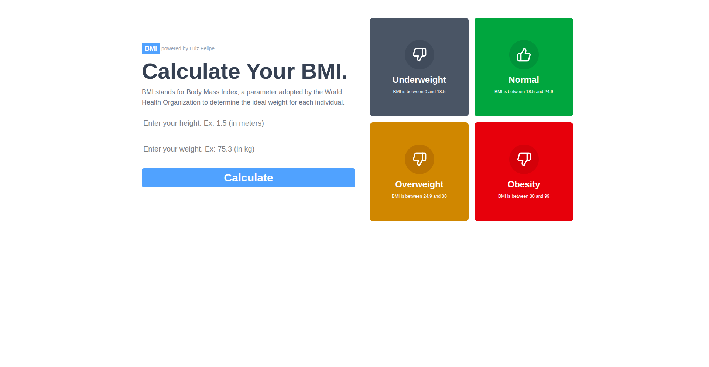

📄 Read in [English](./README.md)
<hr>

# 💪 Calculadora de IMC (Índice de Massa Corporal)

Uma aplicação simples desenvolvida com **React + Vite**, **TypeScript**, **TailwindCSS**, **HTML** e **CSS** para calcular o IMC de uma pessoa com base em seu peso e altura. Este projeto foi criado com o objetivo de **praticar e consolidar conhecimentos em React e TailwindCSS**.

## 📸 Preview

 

## 🔥 Demo

[🔗 Check the project online](https://bmi-calculator-phi-one.vercel.app/)  

## 🚀 Tecnologias Utilizadas

- React
- Vite
- TypeScript
- TailwindCSS
- HTML5
- CSS3

## 📦 Instalação

1. Clone o repositório:

```bash
git clone https://github.com/seu-usuario/nome-do-repositorio.git
