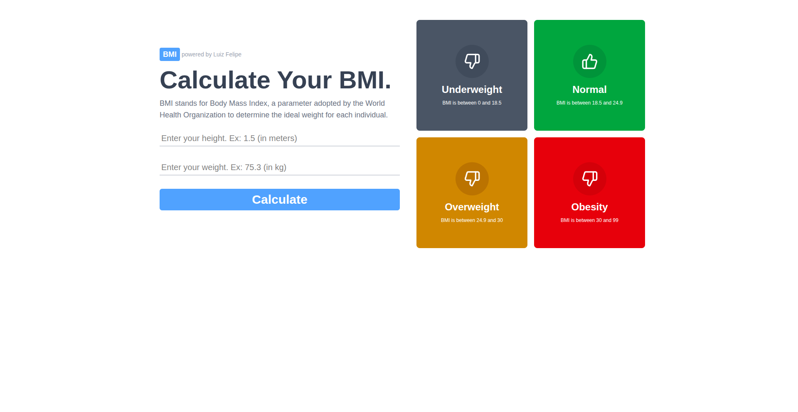

📄 Leia em [Português](./README-pt.md)
<hr>

# 💪 BMI Calculator (Body Mass Index)

A simple application developed with **React + Vite**, **TypeScript**, **TailwindCSS**, **HTML**, and **CSS** to calculate a person's BMI based on their weight and height. This project was created with the goal of **practicing and consolidating knowledge in React and TailwindCSS**.

## 📸 Preview



## 🔥 Demo

[🔗 Check the project online](https://bmi-calculator-phi-one.vercel.app/)  

## 🚀 Technologies Used

- React
- Vite
- TypeScript
- TailwindCSS
- HTML5
- CSS3

## 📦 Installation

1. Clone the repository:

```bash
git clone https://github.com/your-username/your-repo-name.git
